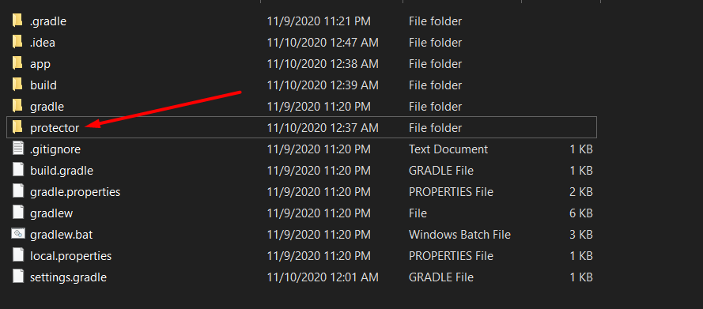
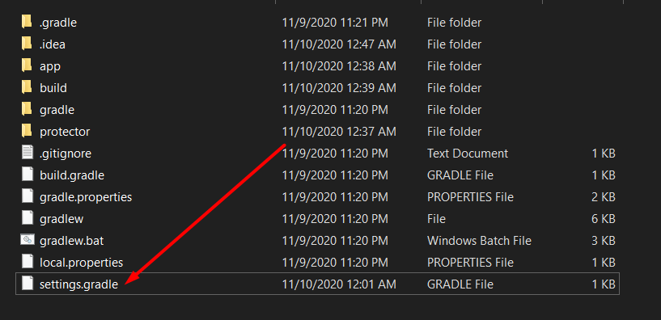
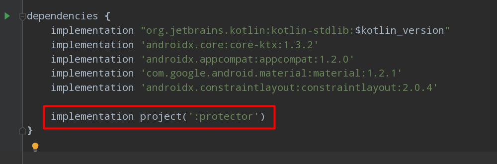
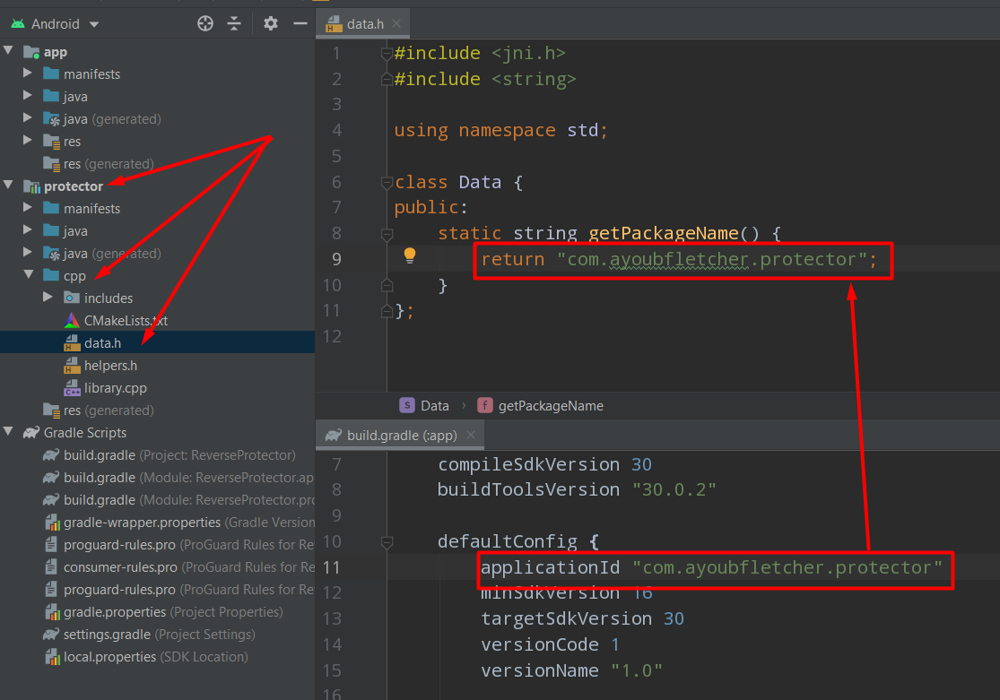

# Android App Protector

---

> Protect your android app from script kiddies of reverse engineering that use apktool with find and replace the package name and replace. Prevent that behavior and block those kiddies "Sorry mates :( .'!

---
## How to add the library into the project
- Copy the folder of the library "protector" into the main directory of the project.



- Add the library into the "settings.gradle"



```gradle
include ':protector'
include ':app'
```

- Include the library into the project on "app.gradle" and Sync the project:




```gradle
dependencies {
    
    implementation project(':protector')

}
```
- Replace the package name in the data.h and make it match the actual package name of your application.



> BE AWARE MAKE SURE THE PACKAGE NAME IS CORRECT AND MATCH THE ACTUAL PACKAGE NAME OF YOUR APPLICATION OR YOUR APP WILL CRASH ON RUN. (WARNED YA :P).

- Build your app and release it and don't worry of those cheap reverse tricks.

---

Made by Ayoub Fletcher with LOVE ❤️.